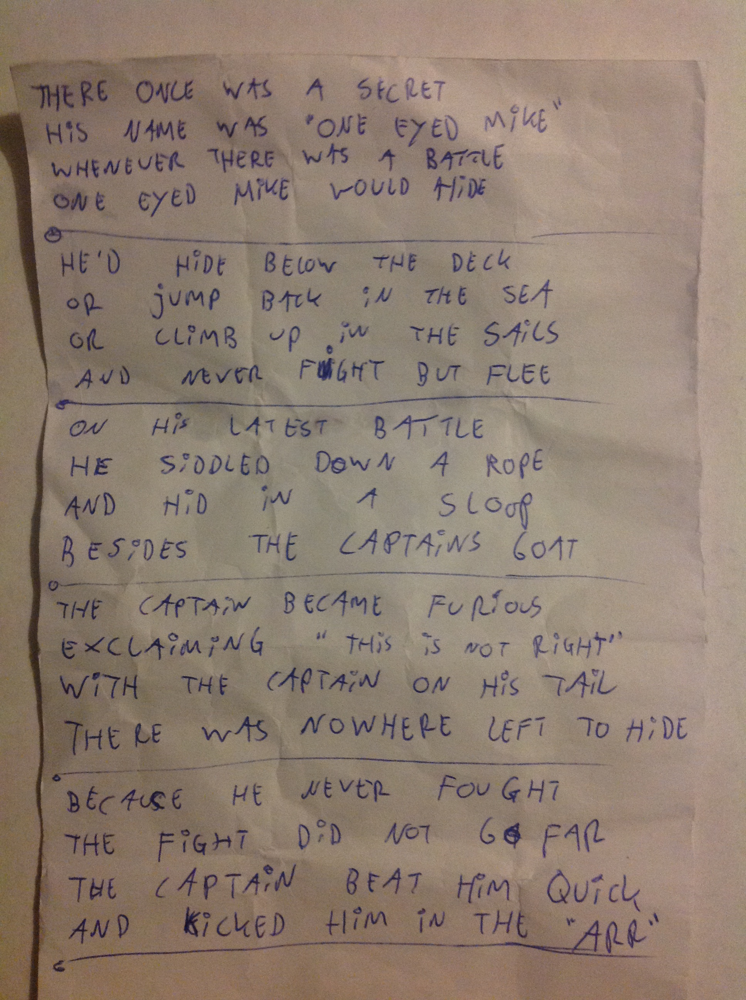

# Day Four

<small>Friday, August 28th 2015</small>

## Introduction

Part of the WeCamp experience (or philosophy) is not only to focus on technology
and software development but also on personal goals and personal development.

To help with this process, each team has it's own coach. Besides act as a
scrum-master to the team, this person also acts as a mentor to the individual
team members.

During the week we already had dedicated moments to focus on each team member's
long term goals. After breakfast and the cross-team standup, I had my one-on-one
session with my coach.

## Its alive, alive I tell you!!!

Near the end of my one-on-one, my team-mate [Jerry] informed me that they were
missing some functionality I had created. It basically came down to me
forgetting to actually commit and push my changes from the last night. After
pair-programming our way through my last-night code, we headed to the yurt.

We were on a tight schedule, as Friday held organized fun in the form of a
survival game (sponsored by [Pragmatist]) followed up by a barbecue (sponsored
by [Enrise]). Because of this, we focussed fully on Integrating our separate
components. After some minor edits we managed to get a [completely working
integration][MVP Tweet] minutes before heading out to lunch.

## I know where you Arrrrrrrrrr.

I shall not get into all of the sword fighting, plank walking, fire-starting, hook
grappling, canon firing and swearing that went on but I'll divulge the shanty
we created for the Pirate Challenges that were part of the survival game:

It was great fun and a nice distraction from the programming and some of
the more serious aspects of WeCamp.

## Barbecue

After the Pirate Games had finished there was time to drink, socialize and
barbecue. I had the privilidge of talking to the nice folks from [Studio Bleep],
who took care of creating [avatars for all the coaches].

[][avatars for all the coaches]

Not much else went on for the duration of the evening other than having fun.

[Jerry]: https://twitter.com/getfocusnl
[Pragmatist]: https://pragmatist.nl/
[Enrise]: https://enrise.com/
[MVP Tweet]: https://twitter.com/potherca/status/637203224173350912
[Studio Bleep]: http://studiobleep.com/
[avatars for all the coaches]: http://studiobleep.com/project/wecamp-2015-edition/
