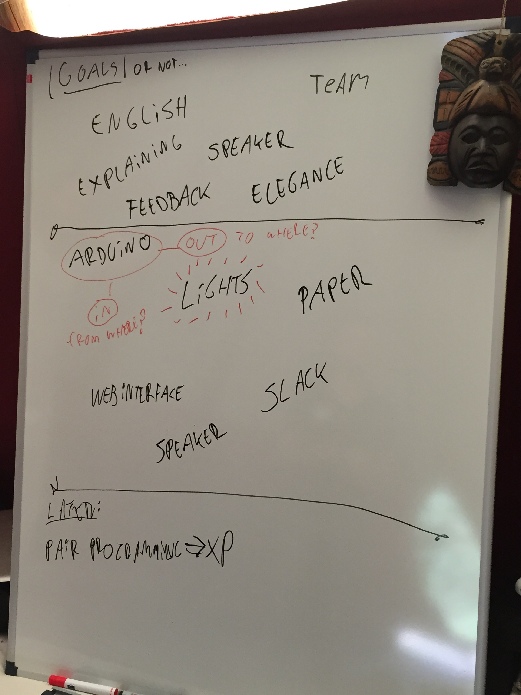

# Day One

## Introduction

Documenting things as they happen always feels like a good plan.

Skipping the travel, general introduction round, sight-seeing and lunch (all of
which where excellent) and moving straight into our team activity.

## Coming up with a plan

After a round of introducing ourselves and stating what motivates us and what we
were looking to take away from WeCamp1, we dove into forming "a plan".

Our teammate [Mitchel] mentioned he had an [Arduino] with him. We all liked
the idea of working/playing with the Arduino, so we tried coming up with a
use-case we would like to build.

After some deliberation we decided we would like to build an HTTP interface for
the Arduino, both client and server2. We didn't have a specific
use-case although there was some mention of slack), so we decided we would
think of an exact use-case at a later time.

1: Top section of the board  
2: Middle section of the board

At this point we did a short (23 minute) timeboxed research round, digging up
resources and checking out tutorials.

(Some of) our most relevant findings were:
- [An article from Instructables.com ](http://www.instructables.com/id/Control-an-Arduino-with-PHP/?ALLSTEPS), which uses the com-port, which wasn't what we wanted)
- [Another article from Instructables.com](http://www.instructables.com/id/PART-1-Send-Arduino-data-to-the-Web-PHP-MySQL-D3js/), which looked better
- [The Arduino Reference manual](https://www.arduino.cc/en/Reference/Ethernet), which has a great webserver and webclient example

We came up with a quick plan of attack3 and after identifying
possible risks to our endeavour4 and set to work, creating a
Proof-of-Concept5.

3: Top section of the board  
4: Middle section of the board  
5: Bottom section of the board

## Creating a proof of concept

The first thing we had to do was connect all the pieces that make up our Arduino
set. This was easy enough with the help of the manual it came with. We even got
an LED to blink!

After that we connected an [Ethernet Shield](https://www.arduino.cc/en/Main/ArduinoEthernetShield)
and started the Server Example. We ran into a hitch there, as we could not seem
to get a response from the Ardunio over the ethernet. Luckily [Jerry] noticed we
hadn't plugged the cable in...

After that we still didn't seem to be able to connect to the ethernet. It took
some figuring out, but it came down to having to [set an IP address](http://www.dummies.com/how-to/content/how-to-create-a-local-network-to-connect-two-macs.html)
 on the laptop that the Ardunio was connected to.

After that we could make a request and get a response. We stood in amazement at
the wonders of HTTP for a while before moving on.

I'm not sure if we also ran through the Client example as I got sidetracked by
a discussion with [Richard] at this point. If the rest of the team did ran
through it in the time it took for the discussion to take place, it can have
been too hard.

In either event we took a short break at this point. Beer may have been involved.

## After the break

Having realized out basic proof of concept, [Jerry] did some more looking and
found two libraries that seemed to do exactly what we are interested in:

 - https://github.com/amcewen/HttpClient
 - http://arest.io/

This meant that our progress was comming along nicely and we would have to come
up with a plan as to what we *actually* want to build. At this point dinner was
announced so we went to enjoy a rather splendid meal (and desert). And there was
much rejoicing.

[Mitchel]: https://twitter.com/MVerschoof
[Jerry]: https://twitter.com/getfocusnl
[Arduino]: https://www.arduino.cc
[Richard]: https://twitter.com/Richard_Tuin
